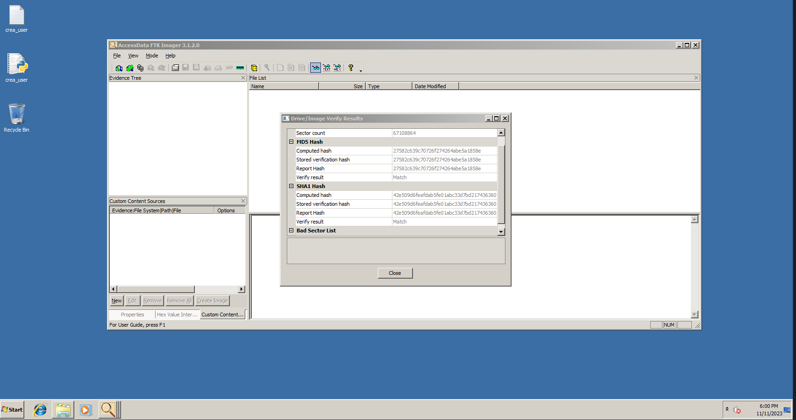
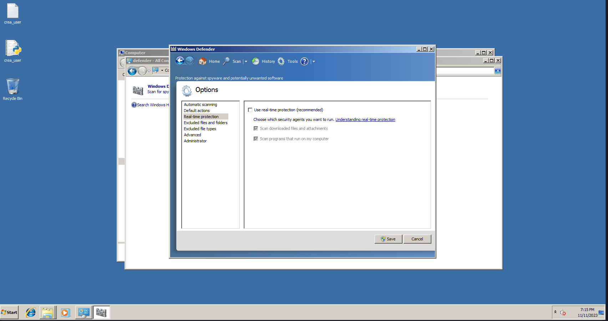
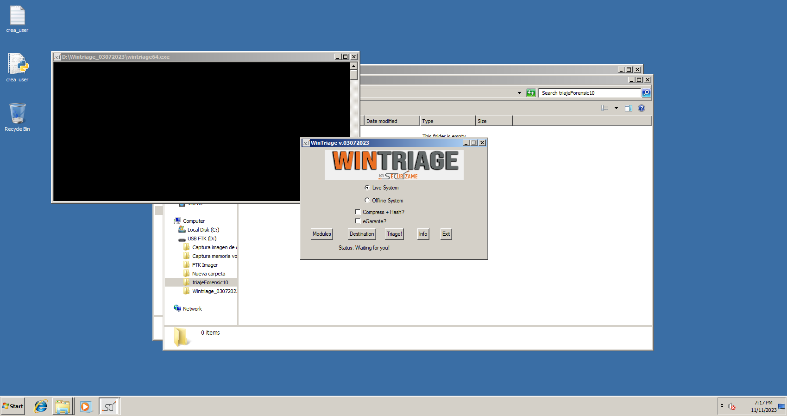

## Introducción

Este documento detalla el proceso adquisición forense de una máquina virtual con Windows 7 Profesional, sospechosa de haber sufrido un incidente de seguridad. 

Presentamos una descripción completa de la evidencia, incluyendo sus características técnicas y el contexto de su descubrimiento. Seguiremos con la fase de adquisición, explicando paso a paso cómo se recolectaron los vestigios digitales, asegurando el cumplimiento de buenas prácticas forenses. En este informe también se documenta toda la cadena de custodia, desde la recopilación hasta el almacenamiento de las evidencias. La intención de este procedimiento es garantizar la integridad y validez de los datos recolectados para su uso en investigaciones y procedimientos legales.

Se incluyen en el proceso el **Acta de Adquisición de evidencias** junto a la **Cadena de Custodia** debidamente cumplimentadas.

## Descripción de la evidencia

El material a analizar que se recibe es una máquina virtual con el sistema operativo Windows 7 edición Profesional, la cual nos informan de que ha sufrido un posible incidente, y se nos solicita un informe forense del mismo.

Dispone de una memoria RAM de 1 GB junto a un disco duro de 32 GB.

La evidencia ha sido encontrada en vivo, por lo que nada más tomar contacto con la máquina la encontramos encendida con la sesión bloqueada.

## Adquisición

En esta fase se procederá a documentar y explicar el proceso mediante el que recolectaremos los vestigios de la evidencia proporcionada. 

Se rellenarán tablas con los datos pertinentes para facilitar su visualización y localización.

> Nota: En algunas de las tablas, algunos campos como modelo, fabricantes o número de series han sido dejados en blanco debido a estar trabajando con una máquina virtual y no existir hardware real.


### Acta de Adquisición de Vestigios

- **Nombre del caso**: Forensic 10
- **Código abreviatura**: F10

### Evidencia 0

| Evidencia F10-0                |                        |
|:------------------------------ |:---------------------- |
| Número de evidencia            | 0                      |
| Tipo de dispositivo            | Máquina objetivo       |
| Tipo de Evidencia              | Ordenador ( Máquina virtual)|
| Formato de evidencia           | .ova                   |
| Fabricante                     |                        |
| Modelo                         |                        |
| Número de Serie                |                        |
| Fabricante del Dispositivo     |                        |
| Modelo del dispositivo         |                        |
| Número de Serie de Dispositivo |                        | 

| Características del dispositivo |     |
|:------------------------------- |:--- |
| Sistema operativo               | Windows 7 Profesional     |
| Formato                         |     |
| Encriptación                    | No     |
| Arquitectura                    | x64     |


| Tecnología empleada para la adquisición           ||
|:--------------------------------------- |:-------- |
| Software utilizado para la adquisición  | Versión  |
| Accessdata FTK Imager                   | 3.1.2 | 

| Credenciales |                |                 |
|:--------------------------- |:-------------- | --------------- |
| **Usuario**                 | **Contraseña** | **Privilegios** |
| Administrador               | HSrupaliuwCCvh | Administrador   |

| Adquirido por (Nombre, Apellidos) | Donde se produjo la adquisición | Fecha |
|:--------------------------------- |:-------------------- | ----- |
| Christian Romero Oliva            | San Fernando, Cádiz                     | 08 Noviembre 2023      |

| Integridad de los datos y testigos |                          |
|:---------------------------------- |:------------------------ |
| Verifcación                        | Sí [ x ] No [  ] N/A [ ] |
| SHA1 HASH                          |                          |
| SHA1 HASH VERIFICADO               |                          |
| Proceso atestiguado por Notario    | Si [  ] No [ x ]          |
| Proceso atestiguado por Notario    | Si [  ] No [ x ]          |

### Cadena de custodia

| Agencia     | IES Rafael Alberti    |
|:----------- |:--- |
| Agente      | Christian Romero Oliva    |
| Caso        | 0    |
| Item        | 0    |
| Descripción | Una de las máquinas del departamento de IT con indicios de vulneración    |


| Albarán | Custodiante             | Fecha         | Hora     | Almacenaje                        | Lugar               | Actividad                             |
| ------- | ----------------------- | ------------- | -------- | --------------------------------- | ------------------- | ------------------------------------- |
| #1      | Rivas Sández, Manuel    | 6 / 11 / 2023 | 12:30 PM |                                   | Cádiz, Cádiz        |                                       |
| #2      | Romero Oliva, Christian | 8 / 11 / 2023 | 20:20 PM | Almacenamiento ordenador personal | San Fernando, Cádiz | Descarga de la evidencia desde Google Drive |


**Traspasos de evidencia**

| Albarán | Custodiante             | Destinatario            | Fecha          | Hora     | Método de traspaso     |
| ------- | ----------------------- | ----------------------- | -------------- | -------- | ---------------------- |
| #1      | Rivas Sández, Manuel    | Romero Oliva, Christian | 6 / 11 / 2023  | 12:30 PM | Enlace de Goggle Drive | 


### Evidencia F10-1

| Evidencia F10-1                |                        |
|:------------------------------ |:---------------------- |
| Número de evidencia            | 1                      |
| Tipo de dispositivo            | Memoria RAM            |
| Tipo de Evidencia              | Captura de memoria RAM |
| Formato de evidencia           | .mem                       |
| Fabricante                     |                        |
| Modelo                         |                        |
| Número de Serie                |                        |
| Fabricante del Dispositivo     |                        |
| Modelo del dispositivo         |                        |
| Número de Serie de Dispositivo |                        | 

| Características del dispositivo |     |
|:------------------------------- |:--- |
| Tamaño de la memoria            |1 GB     |
| Tipo de memoria                 |     |
| Formato                         |         |
| Encriptación                    | No     |

| Tecnología empleada para la adquisición           ||
|:--------------------------------------- |:-------- |
| Software utilizado para la adquisición  | Versión  |
| Accessdata FTK Imager                   | 3.1.2 | 

| Credenciales |                |                 |
|:--------------------------- |:-------------- | --------------- |
| **Usuario**                 | **Contraseña** | **Privilegios** |
|                             |                |                 |

| Adquirido por (Nombre, Apellidos) | Donde se produjo la adquisición | Fecha |
|:--------------------------------- |:-------------------- | ----- |
| Christian Romero Oliva            | San Fernando, Cádiz                      | 08 Noviembre 2023      |

| Integridad de los datos y testigos |                          |
|:---------------------------------- |:------------------------ |
| Verifcación                        | Sí [ x ] No [  ] N/A [ ] |
| SHA1 HASH                          | eb02f26932173660e8a46e483d96c245c92ae325                         |
| SHA1 HASH VERIFICADO               | SÍ                         |
| MD5 HASH                           | 9ee9698b9fc7732bf977c215f3214c7d                           |
| MD5 HASH VERIFICADO                | SÍ                           |
| Proceso atestiguado por Notario    | Si [  ] No [ x ]          |
| Proceso atestiguado por Notario    | Si [  ] No [ x ]          |

### Cadena de custodia

| Agencia     | IES Rafael Alberti    |
|:----------- |:--- |
| Agente      | Christian Romero Oliva    |
| Caso        | 0    |
| Item        | 1    |
| Descripción | Volcado de la memoria volátil del dispositivo    |


| Albarán | Custodiante             | Fecha         | Hora     | Almacenaje                        | Lugar               | Actividad                             |
| ------- | ----------------------- | ------------- | -------- | --------------------------------- | ------------------- | ------------------------------------- |
| #1      | Rivas Sández, Manuel    | 6 / 11 / 2023 | 12:30 PM |                                   | Cádiz, Cádiz        |                                       |
| #2      | Romero Oliva, Christian | 8 / 11 / 2023 | 20:02 PM | Almacenamiento ordenador personal | San Fernando, Cádiz | Creación de vestigios memoria volátil |


**Traspasos de evidencia**

| Albarán | Custodiante             | Destinatario            | Fecha          | Hora     | Método de traspaso     |
| ------- | ----------------------- | ----------------------- | -------------- | -------- | ---------------------- | 
| #2      | Romero Oliva, Christian | Rivas Sández, Manuel    | 11 / 11 / 2023 | 23:45 PM | Enlace de Google Drive  |


### Evidencia F10-2

| Evidencia F10-2                |                        |
|:------------------------------ |:---------------------- |
| Número de evidencia            | 2                      |
| Tipo de dispositivo            | Disco duro de la máquina objetivo            |
| Tipo de Evidencia              | Imagen del disco       |
| Formato de evidencia           | .e01                   |
| Fabricante                     |                        |
| Modelo                         |                        |
| Número de Serie                |                        |
| Fabricante del Dispositivo     |                        |
| Modelo del dispositivo         |                        |
| Número de Serie de Dispositivo |                        | 

| Características del dispositivo |     |
|:------------------------------- |:--- |
| Tamaño de la memoria            | 32 GB     |
| Tipo de memoria                 |     |
| Formato                         | NTFS    |
| Encriptación                    | No     |

| Tecnología empleada para la adquisición           ||
|:--------------------------------------- |:-------- |
| Software utilizado para la adquisición  | Versión  |
| Accessdata FTK Imager                   | 3.1.2 | 

| Credenciales |                |                 |
|:--------------------------- |:-------------- | --------------- |
| **Usuario**                 | **Contraseña** | **Privilegios** |
|                             |                |                 |

| Adquirido por (Nombre, Apellidos) | Donde se produjo la adquisición | Fecha |
|:--------------------------------- |:-------------------- | ----- |
| Christian Romero Oliva            | San Fernando, Cádiz                     | 08 Noviembre 2023      |

| Integridad de los datos y testigos |                          |
|:---------------------------------- |:------------------------ |
| Verifcación                        | Sí [ x ] No [  ] N/A [ ] |
| SHA1 HASH                          | 42e509d6feafdab5fe01abc33d7bd21743636039                        |
| SHA1 HASH VERIFICADO               | SÍ                         |
| MD5 HASH                           | 27582c639c70726f274264abe5a1858e                           |
| MD5 HASH VERIFICADO                | SÍ                           |
| Proceso atestiguado por Notario    | Si [  ] No [ x ]          |
| Proceso atestiguado por Notario    | Si [  ] No [ x ]          |

### Cadena de custodia

| Agencia     | IES Rafael Alberti    |
|:----------- |:--- |
| Agente      | Christian Romero Oliva    |
| Caso        | 0    |
| Item        | 2    |
| Descripción | Imagen del disco creada a partir del disco original    |


| Albarán | Custodiante             | Fecha         | Hora     | Almacenaje                        | Lugar               | Actividad                             |
| ------- | ----------------------- | ------------- | -------- | --------------------------------- | ------------------- | ------------------------------------- |
| #1      | Rivas Sández, Manuel    | 6 / 11 / 2023 | 12:30 PM |                                   | Cádiz, Cádiz        |                                       |
| #2      | Romero Oliva, Christian | 8 / 11 / 2023 | 20:45 PM | Almacenamiento ordenador personal | San Fernando, Cádiz | Creación de imagen de disco |


**Traspasos de evidencia**

| Albarán | Custodiante             | Destinatario            | Fecha          | Hora     | Método de traspaso     |
| ------- | ----------------------- | ----------------------- | -------------- | -------- | ---------------------- |
| #2      | Romero Oliva, Christian | Rivas Sández, Manuel    | 11 / 11 / 2023 | 23:45 PM | Enlace de Google Drive  |

### Evidencia F10-3

| Evidencia F10-3                |                        |
|:------------------------------ |:---------------------- |
| Número de evidencia            | 3                      |
| Tipo de dispositivo            |      |
| Tipo de Evidencia              | Archivos de triaje     |
| Formato de evidencia           | .log, FILE, .txt                  |
| Fabricante                     |                        |
| Modelo                         |                        |
| Número de Serie                |                        |
| Fabricante del Dispositivo     |                        |
| Modelo del dispositivo         |                        |
| Número de Serie de Dispositivo |                        | 

| Características del dispositivo |     |
|:------------------------------- |:--- |
| Tamaño de la memoria            |      |
| Tipo de memoria                 |     |
| Formato                         |     |
| Encriptación                    |     |

| Tecnología empleada para la adquisición           ||
|:--------------------------------------- |:-------- |
| Software utilizado para la adquisición  | Versión  |
| Securízame WinTriage                  | v.03072023 |
| HashMyFile                  | v2.44 |

| Credenciales |                |                 |
|:--------------------------- |:-------------- | --------------- |
| **Usuario**                 | **Contraseña** | **Privilegios** |
|                             |                |                 |

| Adquirido por (Nombre, Apellidos) | Donde se produjo la adquisición | Fecha |
|:--------------------------------- |:-------------------- | ----- |
| Christian Romero Oliva            | San Fernando, Cádiz                     | 08 Noviembre 2023      |

| Integridad de los datos y testigos |                          |
|:---------------------------------- |:------------------------ |
| Verifcación                        | Sí [ x ] No [  ] N/A [ ] |
| SHA1 HASH                          | triageHashesReport.html                       |
| SHA1 HASH VERIFICADO               | SÍ                         |
| MD5 HASH                           | triageHashesReport.html                           |
| MD5 HASH VERIFICADO                | SÍ                           |
| Proceso atestiguado por Notario    | Si [  ] No [ x ]          |
| Proceso atestiguado por Notario    | Si [  ] No [ x ]          |

### Cadena de custodia

| Agencia     | IES Rafael Alberti    |
|:----------- |:--- |
| Agente      | Christian Romero Oliva    |
| Caso        | 0    |
| Item        | 3    |
| Descripción | Archivos de triaje obtenidos a través de la herramienta Wintriage. Logs del sistema, registros, contenido de la papelera, tareas...    |


| Albarán | Custodiante             | Fecha         | Hora     | Almacenaje                        | Lugar               | Actividad                             |
| ------- | ----------------------- | ------------- | -------- | --------------------------------- | ------------------- | ------------------------------------- |
| #1      | Rivas Sández, Manuel    | 6 / 11 / 2023 | 12:30 PM |                                   | Cádiz, Cádiz        |                                       |
| #2      | Romero Oliva, Christian | 8 / 11 / 2023 | 21:35 PM | Almacenamiento ordenador personal | San Fernando, Cádiz | Creación de archivos de triage mediante WinTriage |


**Traspasos de evidencia**

| Albarán | Custodiante             | Destinatario            | Fecha          | Hora     | Método de traspaso     |
| ------- | ----------------------- | ----------------------- | -------------- | -------- | ---------------------- |
| #2      | Romero Oliva, Christian | Rivas Sández, Manuel    | 11 / 11 / 2023 | 23:45 PM | Enlace de Google Drive  |


## Procedimiento ejecutado para la adquisición de vestigios

### Identificación

Siguiendo la metodología elaborada por nuestro grupo de trabajo, en primer lugar debemos identificar los elementos que puedan contener vestigios digitales. 

Teniendo en cuenta que estamos ante una máquina encendida, las fuentes de evidencia más probable serán la memoria volátil (*Memoria RAM*), la memoria no volátil (*Disco duro de la máquina, memoria ROM*) y registros, usuarios, logs, tareas... Todos estos últimos elementos los obtendremos mediante nuestra herramienta de triaje.

Una vez realizado este reconocimiento, procedemos a interactuar con la máquina.

### Adquisición

En primer lugar debemos contar con que llegamos y nos encontramos la máquina encendida, con un aviso en la pantalla que es el siguiente:


No haremos nada con respecto a él, ni siquiera cerrarlo, tratando de mantener el estado lo más próximo posible al original.

Nada mas comenzar a trabajar, lo primero que haremos será **introducir una memoria USB previamente preparada** con nuestras herramientas de trabajo que serán *FTK Imager* y *WinTriage*. 

Hemos decidido usar en primer lugar *FTK Imager* debido a es una única herramienta que nos permite tomar una imagen del disco y de la memoria RAM, además de no ser necesaria su instalación en el equipo ya que se trata de una herramienta *autoportable*.

Es importante tener en cuenta que la máquina objetivo posee Windows 7 Professional como sistema operativo. Ésta es una versión de Windows que no incluye drivers de USB 3.0, habría que instalarlos de terceros y naturalmente para no alterar la máquina no lo vamos a hacer, por lo que si optamos por trabajar con una memoria USB o dispositivo externo, debe ser compatible con los puertos y drivers de USB 2.0.

Una vez que hayamos conectado nuestra memoria y conseguido ejecutar *FTK Imager*, lo primero que haremos será **obtener un volcado de la memoria RAM**, haciendo uso de nuestra metodología en la cual tenemos en cuenta que debido a la volatilidad de los datos, su valor probable y la cantidad de esfuerzo requerido (*NIST 800-86*). 

El volcado lo ubicaremos en la memoria USB que estamos usando para trabajar, evitando así escribir en el disco de la máquina objetivo y por tanto alterándolo lo más mínimamente posible.


Una vez hayamos hecho la adquisición de la memoria volátil, procederemos con la **adquisición de memoria del disco duro de la máquina mediante una imagen de disco**. Vamos a utilizar el formato `.E01` que nos permite aplicar niveles de compresión muy altos.

En este caso vamos a optar por la compresión debido a que disponemos de medios de almacenamiento con espacio algo limitado para esta simulación y además debemos subir los vestigios a Google Drive, por lo que nos interesa que sean de bajo tamaño. Pero en el futuro, opinamos que el mejor enfoque será realizar una imagen `raw` o `.aff` del disco debido a que son compatibles con la gran mayoría de herramientas de análisis forense. Los datos comprimidos deben ser descomprimidos luego para poder trabajar con ellos, por lo que podría afectar a la integridad de los datos. 

También hay que tener en cuenta que los datos comprimidos tienen un mayor nivel de fragilidad, siendo más susceptibles a corromperse o sufrir errores. 

De nuevo, al igual que la captura de memoria volátil, indicaremos que el destino de la imagen será nuestra memoria USB, para no escribir en el disco de la máquina objetivo, procurando mantener la integridad de los datos en el nivel más óptimo posible. 

Vamos a darle el máximo nivel de compresión (9 en *FTK Imager*) por los motivos anteriormente mencionados en cuanto a la disponibilidad de medios.


Al finalizar la creación de la imagen de disco de *FTK Imager*, el software nos generará los hashes **SHA1** y **md5** del disco junto a su verificación.



Manualmente, obtendremos los hashes **SHA1** y **MD5** de la memoria ram mediante las herramientas del terminal de linux `sha1sum` y `md5sum`:

```bash
➜  Captura memoria volatil sha1sum memdump.mem 
eb02f26932173660e8a46e483d96c245c92ae325  memdump.mem
➜  Captura memoria volatil md5sum memdump.mem 
9ee9698b9fc7732bf977c215f3214c7d  memdump.mem
```

Una vez hemos realizado estas adquisiciones procederemos a utilizar la herramienta *WinTriage* para realizar un proceso de triaje en la máquina y obtener así más datos que nos podrían ser útiles en nuestro análisis forense. 

Hemos elegido WinTriage porque utiliza un buen número de herramientas para realizar los análisis y porque es muy sencilla de usar además de liviana. 
Usaremos una versión previamente preparada con todas las herramientas adicionales, entre ellas encontramos: *7zip*, *RawCopy*, *DumpIt*, *LastActivity*... Todas combinadas podrán ayudarnos a recopilar un buen número de vestigios.

Haremos el procedimiento también utilizando la herramienta desde nuestra memoria USB, sin instalarla en la máquina objetivo, y la misma memoria USB será de nuevo el lugar de destino para los datos del triaje. 

Es importante cuando vayamos a usar WinTriage **desactivar el antivirus de la máquina**. El software de triaje instala drivers que permitirán acceder a datos del kernel del sistema operativo, por lo que son necesarios permisos de administrador y ausencia de antivirus que bloquee este tipo de accesos a información del sistema. Este también es uno de los motivos por los que realizamos el triaje tras hacer la imagen de disco y el volcado de RAM, desactivando el antivirus ya estamos interactuando con la máquina más de la cuenta y podríamos estar modificando registros o *logs*. 



Desactivado el antivirus, iniciamos la herramienta con privilegios de administrador, indicamos que se trata de una adquisición *live*, marcamos como destino nuestra memoria USB y comenzamos el proceso de triaje.



Una vez *WinTriage* haya acabado, deberemos realizar un hash de todos esos archivos de triaje de manera externa. Lo haremos con la herramienta *HashMyFile*, la cual nos calculará múltiples tipos de hash: CRC32, MD5, SHA1, SHA256, SHA512, SHA384 y nos generará un archivo `.html` con un reporte de todos ellos. También realizaremos una exportación de estos hashes a un archivo de texto plano por cualquier problema con el archivo `.html`.


Con este último paso ya tendríamos recolectados nuestros vestigios. 

Siguiendo nuestra metodología, durante todo este proceso de adquisición se ha ido documentando, clasificando y completando la información necesaria para cumplimentar debidamente la cadena de custodia, el etiquetado de evidencia y el proceso de adquisición.

Lo siguiente que debemos considerar con la máquina una vez hemos realizado las adquisiciones pertinentes es si debemos apagarla o no. 

Dependerá del caso (por ejemplo uno en el que se considere que la memoria volátil es de crucial importancia) y las políticas legales que se estén siguiendo. Nosotros en este escenario simulado apagaremos nuestra máquina virtual, pero en un escenario real sería conveniente mantener la máquina encendida para disponer de los datos más íntegros posibles, en caso de que se tuviera que hacer algún tipo de nueva adquisición por cualquier motivo.

En cualquier caso, la decisión debe documentarse apropiadamente y dejar constancia de ella en el informe forense.

### Preservación

Una vez hemos acabado con la interacción con la máquina, vamos a proceder a almacenar adecuadamente la evidencia. Actualmente contamos con la siguiente evidencia y vestigios obtenidos de ella:

- Máquina objetivo afectada en formato de máquina virtual (.ova)
- Imagen del disco 
- Volcado de la memoria volátil
- Archivos de triaje generados por WinTriaje

Procederán a almacenarse de la siguiente forma: 

- La **máquina objetivo** quedará en el ordenador personal desde el que hemos realizado la adquisición de la máquina, el cual en caso de transporte irá en una funda protectora para golpes. Se prestará especial cuidado con respecto a la exposición a altas temperaturas, radiaciones electromagnéticas y en todo momento se controlará su ubicación y propietario.

- El **volcado de memoria volátil, la imagen del disco y los archivos de triaje** estarán almacenados en una memoria USB que estará protegida con una funda protectora separada del equipo que contiene la máquina objetivo. Se realizará una copia de seguridad de estas evidencias y se almacenará en un disco externo para garantizar la seguridad de estos vestigios. 

### Fin de la primera parte

Llegados a este punto se ha realizado una recolección y almacenamiento de los vestigios de evidencia y se ha documentado todo el proceso. 

Se procederá a hacer la entrega de los vestigios recolectados a Manuel Jesús Rivas Sández a través de un enlace en la plataforma Google Drive.

Se han intentado seguir y documentar la mayoría de pasos de la metodología que nuestro grupo ha elaborado, pero llegados a este punto no podemos seguir aplicandola debido a que se escapa del ámbito de la práctica. 

> Nota: En un caso real, traspasar las evidencias mediante el uso de 
> Google Drive es algo completamente inconcebible. La evidencia podría verse afectada en el proceso de subida y descarga, Google tendría acceso a esos datos y la privacidad en absoluto estaría garantizada, y el traspaso de evidencia, considerando que normalmente se tratan de archivos de gran tamaño, podría resultar un proceso lento y torpe. Sin embargo en nuestro escenario simulado suple adecuadamente nuestras necesidades.
